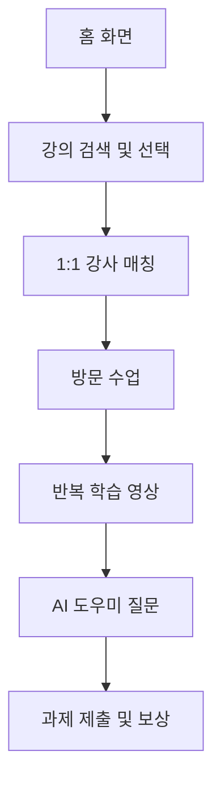

# 📱 SlowStarter

> **경계선 지능인을 위한 오프라인 강사 매칭 + 반복 학습 지원 앱**  
> 반복 가능한 영상 학습, AI 실시간 질문 응답, 맞춤 강사 시스템으로 자존감과 학습 지속성을 키웁니다.

---

## 🎯 프로젝트 개요

**SlowStarter**는 고등학생 경계선 지능인을 위한 직무 기술 학습 플랫폼입니다.  
사용자의 낮은 자존감, 반복 학습 필요, 진로 불안 등의 문제를 해결하기 위해 다음과 같은 기능을 제공합니다:

- 1:1 강사 매칭 및 방문 수업
- 숏폼 반복 학습 영상
- AI 챗봇 실시간 Q&A
- 과제 제출 및 보상 시스템

---

## 👤 페르소나: 고요한

| 항목 | 내용 |
|------|------|
| 이름 | 고요한 |
| 나이 | 18세 (고3) |
| IQ | 78 (경계선 지능 범주) |
| 상황 | 인문계 고등학교 재학, 반에서 80등권 |
| 성격 변화 | 외향적 → 내향적 (친구들과의 거리감 경험 때문) |
| 특징 | 요점 파악 어려움, 기억력 부족, 스트레스로 인한 과식 |
| 고민 | 미래에 대한 불안, 자신에게 맞는 길을 찾지 못함, 표현 어려움 |

---

## 📦 핵심 기능

| 기능 | 설명 |
|------|------|
| 📺 반복 학습 영상 | 짧고 단순한 맞춤 VOD 학습 콘텐츠 중심 구성 |
| 🤖 AI 도우미 | 영상 학습 중 실시간 질문 가능 |
| 🧑‍🏫 방문 수업 | 강사가 사용자에게 맞춤형 수업 제공 |
| 📸 과제 제출 | 사진 등으로 과제 제출 → 포인트 → 아이템 보상 |

---

## 🛠 기술 스택

- **UIKit** – iOS UI 구성
- **Combine** – 비동기 데이터 흐름 처리
- **SnapKit** – 오토레이아웃 DSL
- **Tuist** – 프로젝트 구성 자동화
- **SwiftLint** – 코드 품질 유지
- **Supabase** – 백엔드(DB, Auth, Storage)
- **Clean Architecture** – 계층 구조화 및 테스트 용이성 확보

---

## 🧭 사용자 흐름

## 💸 수익 모델

### B2C
- 월 정액 구독
- 강의 단건 결제

### B2G
- 복지기관 대상 평생교육 운영 계약
- 공공기관 연계 지원 프로그램

---

## 📊 시장 분석 (TAM–SAM–SOM)

| 구분 | 설명 | 규모 |
|------|------|------|
| **TAM** | 전 세계 기술 직무 교육 시장 | 812조 원 |
| **SAM** | 실습 기반 VOD 중심 일반인 시장 | 1조 4,730억 원 |
| **SOM** | 경계선 지능 고3 학생 대상 시장 | 2,134억 원 |

> 출처:  
> - GrandViewResearch, Technical Vocational Education Market (2024)  
> - 교육부 고등학생 통계 (2023)  
> - 한국에듀테크산업연합회 보고서 (2025)  
> - 아이폰 점유율 / 사교육 평균 비용 통계 (한국헤럴드 외)

---

## 🧠 사회적 가치 및 기대 효과

- **학습 지속성 향상**: 반복 학습과 맞춤 피드백으로 성취 경험 제공
- **자존감 회복**: 긍정적 피드백 중심의 설계
- **복지 사각지대 해소**: 경계선 지능인의 진로 및 자립 지원
- **일자리 창출**: 퇴직 교사 및 복지 전문가의 강사화

---

## 🎁 프로젝트의 차별성

- **기존 서비스 한계 극복**: 일반 교육 앱은 고기능 학습자를 대상으로 설계되어 경계선 지능인에게는 진입장벽이 높음
- **1:1 방문 수업 + 반복 학습 + AI 도우미** 조합은 기존에 없던 하이브리드 구조

## 🖼️ 스크린샷

> 📌 추후 앱 UI 및 시연 영상 추가 예정

<table>
  <!-- 첫 번째 행 -->
  <tr>
    <td align="center">
      <strong> 반복학습 1: 영상재생 및 VOD 변경</strong>  
      
 테이블 뷰 선택시 영상이 변경되며 재생 가능합니다..

      
    </td>
    <td align="center">
      <strong> 반복학습 2: 과제제출 1</strong>  
      
 라이브러리의 사진으로 과제를 제출합니다. 

      
    </td>
    <td align="center">
      <strong>기능 3: 과제 제출 2 </strong>  
      
 사진을 촬영하여 과제를 제출합니다. 

      
    </td>
  </tr>
  <!-- 두 번째 행 -->
  <tr>
    <td align="center">
      <strong>기능 4: 목록과 디테일 뷰 </strong>  
      
강의 목록에서 디테일 뷰로 진입하여 오리엔테이션 영상과 강의 이미지를 확인합니다. 

      
    </td>
    <td align="center">
      <strong>기능 5: AI와 채팅 </strong>  
      
제출한 과제의 메모를 수정하거나, 필요 없는 과제를 삭제할 수 있습니다.

      
    </td>
    <td align="center">
      <strong>기능 6: 채팅 요약 </strong>  
      
메인 화면에서 출석하기 버튼을 누르면 오늘의 스탬프가 채워집니다.

      
    </td>
  </tr>
</table>
---

## 👨‍👩‍👦 팀 소개

| 직책 | 이름 | 역할 |
|------|------|-----------|
| 팀장 | 고요한 | 프로젝트 총괄, 서비스 기획 및 전체 구조 설계 |
| 팀원 | 이재용 | 동영상 플레이어 및 반복 학습 모듈 개발 |
| 팀원 | 조태연 | AI 챗봇(Q&A) 기능 구현 |
| 팀원 | 김대홍 | 기획 관리 및 UI 기본 틀 설계 |
